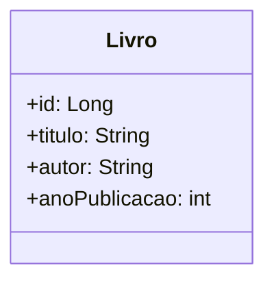

# API de Cadastro de Livros
Trata-se de uma API simples para cadastro de livros, utilizando tecnologias como Spring Boot em Java.

Funcionalidades Principais:
Cadastro de Livros: Adicione novos livros à base de dados com informações como título, autor e ano de publicação.

Listagem de Livros: Consulte a lista completa de livros cadastrados.

Busca por Nome: Realize buscas por nome do livro para encontrar informações específicas.

Atualização e Exclusão: Atualize informações ou remova livros existentes.

Tecnologias Utilizadas:
Spring Boot: Framework para desenvolvimento de aplicações Java.

Spring Data JPA: Facilita o acesso e manipulação de dados utilizando o padrão de mapeamento objeto-relacional.

RESTful API: Adoção de princípios REST para comunicação entre cliente e servidor.

Como Executar:
Clone este repositório.
Configure as propriedades do banco de dados no arquivo application.properties ou application.yml.
Execute a aplicação Spring Boot.
Contribuições e Problemas:
Contribuições são bem-vindas! Se encontrar algum problema ou tiver sugestões de melhoria, por favor, abra uma issue neste repositório.

Agradecemos a oportunidade de aprendizado oferecida pela Digital Innovation One! 😊

